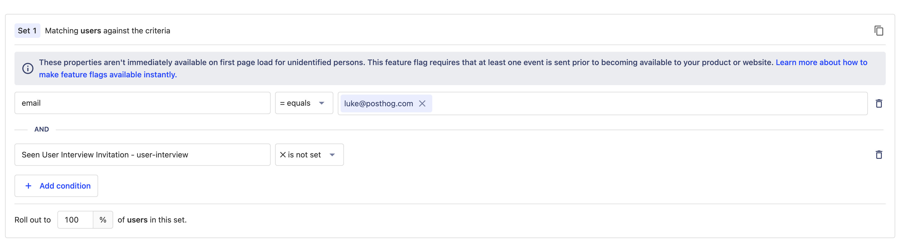
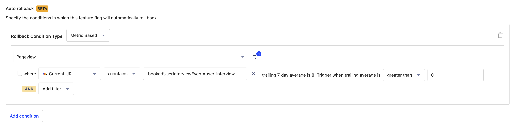

# User Interview App

Invite your users to an interview through an in-app pop-up with this app.

## Installation

1. Make sure you have enabled `opt_in_site_apps: true` in your posthog-js config.
2. Install the app from the PostHog App Repository
3. Customize the text and theme using the app config

## Adding a user interview

1. Create a feature flag to control who sees it. For this example, we'll use the name `user-interview`
   1. Set up the filters for the people that you want to speak to (e.g. they have @posthog.com in their email, they have paid at least $5k etc.).
      - The filters can only be on a user's properties, not the events.
      - If you want to invite users based on historical actions, create an insight for that action and then use that to create a static cohort.
      - If you want to invite users based on them doing certain actions you'll need to update the users property in the app once they've done that action.
   2. Set the filter `Seen User Interview Invitation - {featureFlagName}` to `is not set` so that it doesn't show to users who have seen the user interview already. (This property will be added once the user has interacted with the popup - either to close it or to book in a time)
      
   3. Add an autorollback based on the pageview where `Current URL` contains `bookedUserInterviewEvent={FEATURE_FLAG_NAME}`. This is where you'll redirect them after they've booked in. Set the average over last 7 days to be 1 for up to 7 interviews to be booked and 2 for up to 14 interviews to be booked.
      - *This requires the auto-rollback-feature-flags feature flag to be turned on*
      - **Note: autorollbacks is still in beta and so you should set a reminder in a few hours/days to manually turn off the feature flag if it's not already off**
      - TODO: update autorollback to use count instead of average to make controlling the number of booking easier
      
   4. If the filters are broad, you should set the rollout to a small percentage first and check that it's being shown to the correct number of people ([a dashboard like this](https://app.posthog.com/dashboard/56687) is useful for tracking who has seen the popup)
2. Create your calendly event
   1. Set the redirect after booking to be `{Your app}?bookedUserInterviewEvent={FEATURE_FLAG_NAME}` e.g. `https://app.posthog.com/home?bookedUserInterviewEvent=user-interview`
   2. Make sure there's appropriate availability for people from the timezones you are showing the popup to book in
3. Add the feature flag and booking link to the app config `interviewConfigs` (you can have multiple feature flags with corresponding booking links by separating them with commas e.g. interview-high-icp=https://calendly.com/user1/book-high-icp,user-interview=https://calendly.com/user1/user-interview).
4. Rollout out the feature flag

The flags won't be shown to users who have seen a user interview popup within the last 90 days (configured with `minDaysSinceLastSeenPopUp`)

## Demo


## Tracking events

| Event name | Properties | Notes |
| ---------- | ----------- | ----------- |
| `User Interview Shown Pop Up` | `{featureFlagName: featureFlagName}` | |
| `User Interview Dismissed Pop Up` | `{featureFlagName: featureFlagName}` | |
| `User Interview Clicked Book Button` | `{featureFlagName: featureFlagName}` | |
| `User Interview Booked` | `{featureFlagName: featureFlagName}` | Requires the redirect after booking to be setup |

## User properties

| Property name | Notes |
| ------------- | ----------- |
| `Seen User Interview Invitation - {featureFlagName}` | Date when the user interview invitation was shown |
| `Seen User Interview Invitation` | Date when any user interview invitation was last shown |

## Local development

For local development, clone the repo and run

```bash
npx @posthog/app-dev-server
```

or

```bash
pnpm install
pnpm start
```
