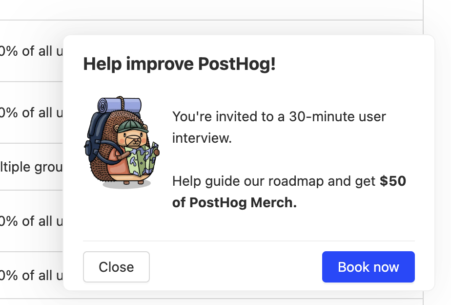

# User Interview App

Invite your users to an interview through an in-app pop-up with this app.

## Installation

1. Make sure you have enabled `opt_in_site_apps: true` in your posthog-js config.
2. Install the app from the PostHog App Repository
3. Customize the text and theme using the app config
4. Create a feature flag starting with `interview-` with the booking link as a payload and the appropriate filters set [instructions here](https://posthog.com/docs/apps/user-interview)

## Demo



## Tracking events

| Event name | Properties | Notes |
| ---------- | ----------- | ----------- |
| `User Interview Shown Pop Up` | `{featureFlagName: featureFlagName}` | |
| `User Interview Dismissed Pop Up` | `{featureFlagName: featureFlagName}` | |
| `User Interview Clicked Book Button` | `{featureFlagName: featureFlagName}` | |
| `User Interview Booked` | `{featureFlagName: featureFlagName}` | Requires the redirect after booking to be setup |

## User properties

| Property name | Notes |
| ------------- | ----------- |
| `Seen User Interview Invitation - {featureFlagName}` | Date when the user interview invitation was shown |
| `Seen User Interview Invitation` | Date when any user interview invitation was last shown |

## Local development

For local development, clone the repo and run

```bash
npx @posthog/app-dev-server
```

or

```bash
pnpm install
pnpm start
```
