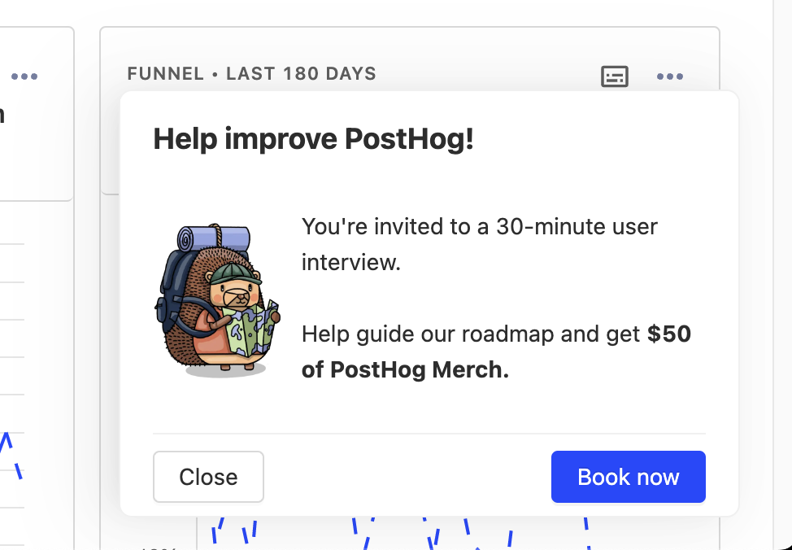

# User Interview App

Invite your users to an interview through an in-app pop-up with this app.

## Installation

1. Make sure you have enabled `opt_in_site_apps: true` in your posthog-js config.
2. Install the app from the PostHog App Repository
3. Customize the text and add your booking link e.g. Calendly/Cal.com and enable the plugin
4. Create a feature flag to control who sees it

You can track who sees the popup

## Demo



## Local development

For local development, clone the repo and run

```bash
npx @posthog/app-dev-server
```

or

```bash
pnpm install
pnpm start
```